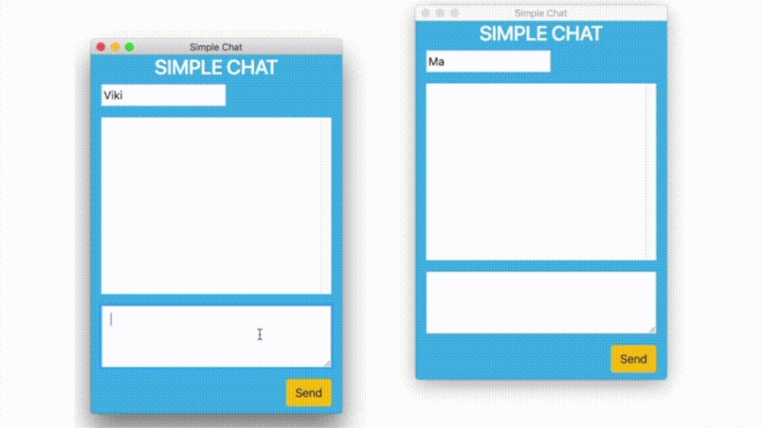

## Simple Chat Application using WebSockets

## Install Server and Client 

#### Step 1:  [ Open Terminal ] [ Install Server ]
	
	$cd ./server_app 
	$./install.sh  

#### Step 2:  [ Open Terminal ] [ Install Server ]
	
	$cd ./client_app 
	$./install.sh  

## Run Server [ Open Terminal 1 ] 
    
    $cd ./server_app 
	$./run.sh 

## Run Clients

#### Client 1 :  [ Open Terminal 2 ] 
    
    $cd ./client_app
	$./run.sh 

#### Client 2 :  [ Open Terminal 3 ] 
    
    $cd ./client_app
	$./run.sh 

